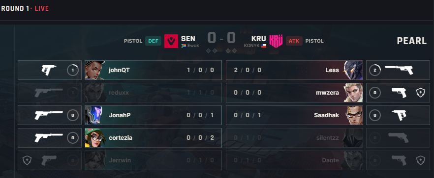
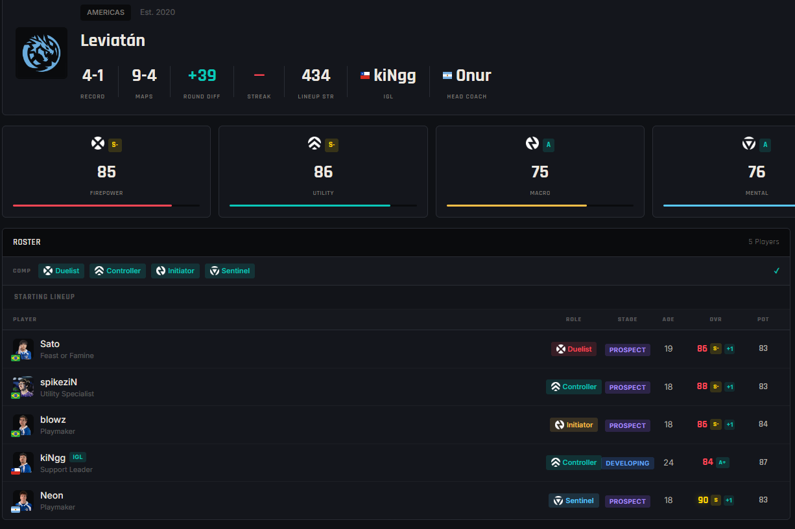
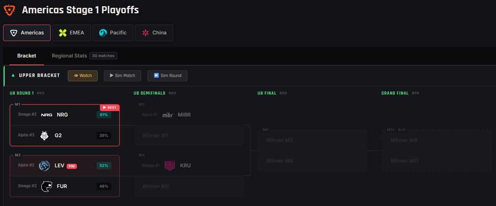
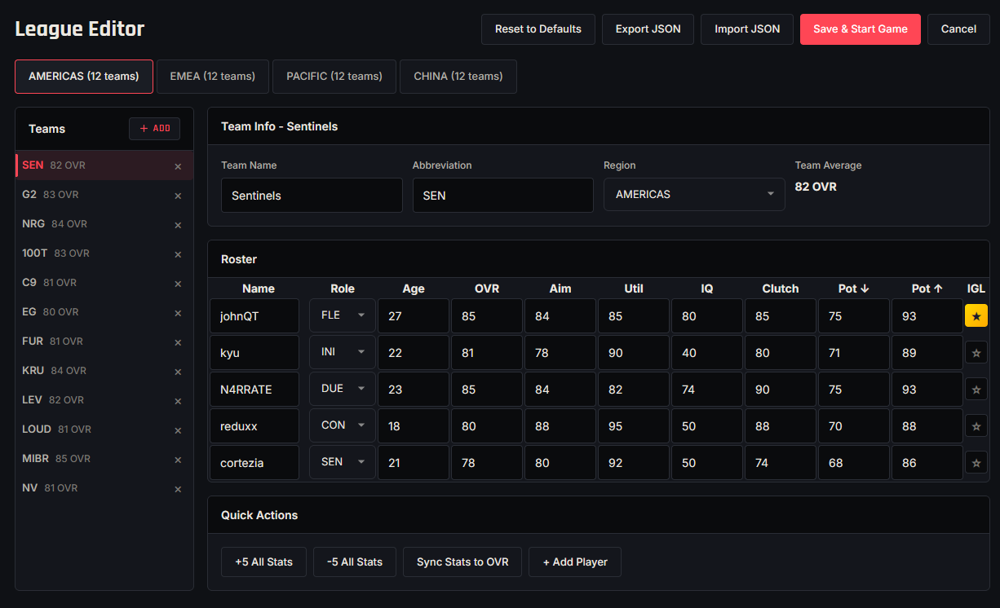

# Valogm — VALORANT Esports Manager

A browser-based esports management sim. You take over a professional VALORANT team and run it across full competitive seasons, from regional Kickoff through international Champions.

Inspired by [Basketball GM](https://basketball-gm.com/) by dumbmatter.

**Stack:** React · TypeScript · Vite · Zustand · seeded RNG (`seedrandom`) · `localStorage` saves

## The idea

I've always been drawn to roster management games for competitive sports, and to the what-ifs of building and running a team. This project is my version of that itch, pointed at VALORANT, a tactical-shooter game. The whole thing is built around an engine that plays each match out round by round, the same way a real game unfolds, so that results come from _how_ a match is played rather than a coin flip on team rating.

That one decision shapes everything else. Because matches are simulated in detail, economy matters, agent picks matter, who your in-game leader is matters, and a worse team on a good day can take down a favorite. The front office (drafting, trading, developing players) then sits on top of a simulation that actually rewards good roster-building over a season.

## How a match plays out

A match is a series of maps, and each map is a series of rounds. Every round, the engine works through what really decides a VALORANT round:

First it looks at each team's **economy and buy state** (full buy, half, force, eco, or save), which shifts how well that team can perform that round. Then every player is scored by a **performance index** (internally `pIndex`) that blends their overall rating, aim, how well they fit their assigned role, clutch factor, an in-game-leader bonus, and team-composition effects. **Agent abilities and ultimates** factor in based on when they would actually fire: execute ults before the round, defensive ults reactively after a teammate falls, info ults once there is a body to scan. The round then resolves duel by duel, weighted by all of the above.

Rounds add up to maps, maps to series, series to tournaments, and a full season of those produces champions, award winners, and record-book entries.

The randomness is controlled, not chaotic. Everything random flows through a single **seeded RNG** which means a given save reproduces exactly while two separate playthroughs diverge into their own stories. The models behind the scenes:

- **pIndex:** per-player, per-round score from overall, aim, role fit, clutch, IGL bonus, composition, and buy state
- **Win probability:** estimated from each team's aggregate pIndex to set series odds
- **Economy curve:** each buy state applies its own modifier, so eco rounds are disadvantaged but winnable
- **Composition and role fit:** bonuses for balanced comps, penalties for playing off-role
- **Ultimate timing:** per-agent usage rates and timing windows
- **Progression curves:** age-based growth and decline that change player overalls each season



## Running the front office

Winning once is roster-building. Winning over years is management. Players progress, peak, and decline with age, and their overalls shift accordingly season to season, so the roster you assemble today will need refreshing later. New prospects regenerate every year, and a transfer market with free agency, trades, and scouting gives you the levers to keep up. There is no "set it and forget it" dynasty.



## The season

You can play any team across the four regions (Americas, EMEA, Pacific, and China) through the full VCT-style calendar: Kickoff brackets, Stage group stages and playoffs, international events, and Champions. Championship points carry across events, and an all-time records book persists from season to season.



## Make it your own

If you would rather not take the league as given, the League Editor lets you edit every team, roster, and player rating before you start. Custom League hands you real teams with fresh randomized rosters for a clean slate, and any league can be exported or imported as JSON to save and share setups.



## FAQ

### Is every run the same?

No, each new game plays out on its own, with different upsets, breakout players, and champions. A single save is deterministic from its seed, so it stays internally consistent and reproducible, but separate playthroughs diverge into their own stories. There's also a sandbox mode that lets you simulate against older and nostalgic rosters, just like in basketballgm.

### Do the best teams with the best players always win?

No. Higher pIndex teams are favored, but matches resolve round by round and duel by duel, so economy swings, composition, and clutch moments produce real upsets. A favorite usually takes a best-of series, but single maps and full tournaments still surprise you (whether for good or for worse).

### How much randomness is there?

It is weighted, and it is definitely not a coin flip. Each player's contribution runs through pIndex (overall, aim, role fit, clutch, IGL bonus, composition, and buy state), and the seeded RNG resolves the individual duels around those weights. Skill and roster-building win out over a season, while the variance lives in individual rounds and maps.

### Does team composition and agent choice actually matter?

Yes. Role balance feeds composition bonuses and penalties, playing someone off their role carries an explicit penalty, and agent ultimates factor into rounds based on when they fire. A stacked roster on a bad comp underperforms.

### Do players develop or decline?

Yes, players progress, peak, and fall off with age, and their overalls change accordingly season to season. New prospects regenerate each year, so rosters need active management.

### Can I just sim, or actually watch the games?

You can do both. Blow through a season quickly, or open the live match view for a round-by-round play-by-play.

### What's the replay value?

Different teams across four regions, custom leagues and a full editor, a transfer market with free agency and trades, players who rise and decline, regenerating prospects each season, and titles, awards, and records to chase year over year.

### Is this connected to real VCT results?

No. It uses real team names with fictional, editable rosters. It is a simulation, not a results tracker.

### Do I need an account or internet?

Nope, it all runs entirely in your browser, just like basketballgm. Free, no installations, no sign-up, and you can play it on your flight if you have it loaded before (which I have done so myself haha). All saves stay on your device.

## Project structure

```
src/
├── sim/      Simulation engine (match resolution, brackets, free agency, progression, awards)
├── data/     Static game data (agents, abilities, roles, archetypes, teams)
├── types/    Shared domain types
├── stores/   Zustand state (game + UI)
├── db/        localStorage save/load
├── ui/        React components
└── utils/     Seeded RNG and helpers
```

`sim/` is pure and UI-agnostic; `ui/` only renders what the engine produces.

## Run locally

```bash
npm install
npm run dev        # dev server
```

## Disclaimer

This is an unofficial, and non-commercial fan project. Not affiliated with or endorsed by Riot Games. VALORANT and related assets are property of Riot Games, Inc.
